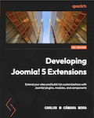

<!--
_class: cover 
-->

---
<!--
_header: "Why I'm here"
footer: '[Developing Extensions for Joomla! 5](https://developingextensionsforjoomla5.com/jdayusa2024)'
-->

# ~~Part 1: Developing a ToDo list app~~
1. ~~Planning the component~~
2. ~~Creating the tables in the database~~
3. ~~Understanding folder structure~~
4. ~~Describing our component to Joomla~~

---
<!--
_header: "What are we goig to see"
-->

# Part 2: Developing our WebService
1. Web Services Basics
2. Creating an end point for our Web Service
3. Adding the logic for the Web Service
3. Having fun!!

---

<!--
_header: "Web Services Basics"
-->

- Machine language
- No HTML, replies in JSON, XML...
- Hard to test in a browser
- 4 verbs: POST, GET, PATCH, DELETE
- No user session

### References

Chapter 6

---
<!--
_header: "Consuming Joomla Web Services"
-->

- POSTMAN, **HOPPSCOTCH**, PHP scripts, cURL, editor plugins...
- Need to create a token for your Joomla user in any case

### References

Chapter 6

---
<!--
_header: "Creating an end point for our Web Service"
-->

https://developingextensionsforjoomla5.com/jdayusa2024/live/4-webservices-plugin

- Routes are added with plugins of type *webservices*
- In the route you may define the different actions you allow
- The *createCRUDRoutes()* method add all possible actions to the Web Service

### References

Chapter 6

---
<!--
_header: "Handling the request in our component"
-->

https://developingextensionsforjoomla5.com/jdayusa2024/live/5-api

- Create the ProjectsController.php
- Create the JsonapiView.php

### References

Chapter 6

<!--
- We extend Joomla’s ApiController class, which will save us lots of coding as
this class already provides the basic methods such as displayList() and add().
-->

---

<!--
_header: "on the shoulder of giants"
-->

- Joomla Extension Development by Nicholas Dionysopoulos
  - https://www.dionysopoulos.me/book.html
- Joomla 4 – Developing Extensions: Step by step to an working Joomla extension
  - https://a.co/d/1BIVa8j
  - https://web.archive.org/web/20230518080457/https://blog.astrid-guenther.de/en/der-weg-zu-joomla4-erweiterungen/

- Joomla! Documentation
  - https://manual.joomla.org

  <!-- I have not seen furhther but I definitely was on the shoulders of giants.-->

---
<!--
_class: thank-you
footer: ''
-->

    Thank you!

